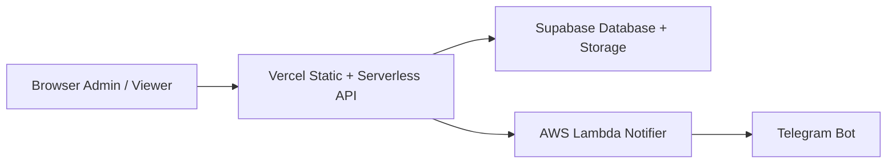

# Dashboard Maulagi

Dashboard internal untuk input bukti transfer, rekap transfer cabang, monitoring NONCOD/DFOD, dan operasi admin. Aplikasi memakai halaman HTML statis di root proyek dan API serverless di folder `api/`, dengan penyimpanan data dan file di Supabase. Notifikasi operasional berjalan dengan arsitektur hybrid `Vercel -> AWS Lambda -> Telegram`.

## Ringkasan

- Login admin berbasis password yang disimpan di tabel `settings`.
- Input transfer dengan upload bukti ke bucket `bukti-transfer`.
- Rekap transfer dan monitoring aktivitas cabang.
- Dashboard NONCOD dan DFOD dengan sinkronisasi data MauKirim.
- OCR bukti transfer untuk bantu baca nominal dan channel bank.
- Panel admin untuk kelola cabang, transfer, password, dan log error.
- Notifier operasional Telegram aktif lewat AWS Lambda tanpa memindahkan backend utama dari Vercel.

## Arsitektur Hybrid



Ringkasnya:

- Frontend dan API utama tetap jalan di Vercel.
- Data transaksi, master cabang, log, dan file bukti tetap disimpan di Supabase.
- AWS Lambda dipakai khusus untuk relay notifikasi operasional ke Telegram.
- Pola ini sengaja dipilih agar deploy tetap sederhana, biaya tetap hemat, tetapi stack terlihat lebih kuat untuk automation berikutnya.

## Stack

- Vercel untuk hosting statis dan fungsi serverless.
- Supabase untuk database dan penyimpanan objek.
- AWS Lambda untuk notifier operasional dan integrasi Telegram.
- HTML, CSS, dan JavaScript tanpa framework untuk frontend.
- Node.js untuk runtime API dan utilitas lokal.

## Struktur Proyek

```text
.
|-- api/           # Fungsi serverless Vercel dan helper backend
|-- lib/           # Modul browser/shared logic
|-- scripts/       # Utilitas lokal, template AWS Lambda, dan arsip lama
|-- tests/         # Test Node bawaan
|-- *.html         # Halaman aplikasi
|-- sql-*.sql      # SQL tambahan untuk indeks dan keamanan
|-- vercel.json    # Konfigurasi deployment Vercel
```

Tambahan penting di dalam `scripts/`:

- `scripts/aws/telegram-notifier/` untuk template AWS Lambda notifier Telegram.

## Halaman Utama

- `/index.html` untuk halaman awal dan akses masuk.
- `/dashboard.html` untuk halaman kerja utama.
- `/input.html` untuk input transfer dan OCR bukti.
- `/rekap.html` untuk rekap transfer per cabang.
- `/noncod.html` untuk monitoring NONCOD dan DFOD.
- `/admin.html` untuk operasi admin.

## Endpoint API

- `/api/auth` untuk login, setel password awal, dan ganti password.
- `/api/dashboard` untuk ringkasan transfer dashboard.
- `/api/input` untuk simpan transfer baru dan upload bukti.
- `/api/cabang` untuk list dan CRUD data cabang.
- `/api/transfer` untuk list, edit, hapus, dan split transfer.
- `/api/noncod` untuk ringkasan NONCOD/DFOD dan sinkronisasi data MauKirim.
- `/api/check-update` untuk ringkasan update transfer.
- `/api/check-dupe` untuk cek duplikasi sebelum input.
- `/api/ocr` untuk ekstraksi data bukti transfer.
- `/api/logs`, `/api/visit`, dan `/api/proxy-image` untuk kebutuhan operasional.

## Persiapan Lokal

### Prasyarat

- Node.js 18 atau lebih baru.
- Akun dan proyek Supabase.
- Proyek Vercel untuk menjalankan API secara lokal maupun produksi.

### Menjalankan Lokal

1. Install dependensi:

```bash
npm install
```

2. Salin `.env.example` menjadi `.env`.
3. Isi environment variable yang dibutuhkan di `.env`.
4. Jalankan aplikasi dengan perintah berikut:

```bash
npx vercel dev
```

5. Buka URL lokal yang ditampilkan oleh Vercel.

## Variabel Lingkungan

Template tersedia di `.env.example`.

```env
SUPABASE_URL=https://your-project.supabase.co
SUPABASE_ANON_KEY=your-anon-key-here
SUPABASE_SERVICE_ROLE_KEY=your-service-role-key-here
ALLOWED_ORIGIN=https://your-domain.vercel.app
MAUKIRIM_WA=628xxxxxxxxxx
MAUKIRIM_PASS=your-maukirim-password
GROQ_API_KEY=your-groq-api-key
UPSTASH_REDIS_REST_URL=https://your-upstash-instance.upstash.io
UPSTASH_REDIS_REST_TOKEN=your-upstash-token
EXCEL_PATH=C:/path/to/source.xlsx
```

Kebutuhan utama:

- `SUPABASE_URL` dan `SUPABASE_SERVICE_ROLE_KEY` wajib untuk semua API server.
- `SUPABASE_ANON_KEY` opsional, dan tidak dipakai backend repo ini.
- `SUPABASE_SERVICE_ROLE_KEY` juga dipakai script maintenance lokal yang menulis/menghapus data.
- `MAUKIRIM_WA` dan `MAUKIRIM_PASS` dipakai untuk sinkronisasi NONCOD/DFOD.
- `GROQ_API_KEY` dipakai fitur OCR.
- `UPSTASH_REDIS_REST_URL` dan `UPSTASH_REDIS_REST_TOKEN` dipakai rate limiter lintas instance.
- `EXCEL_PATH` hanya dipakai script migrasi lokal.

## Sumber Daya Supabase

Proyek ini mengandalkan resource berikut:

- Tabel `settings`
- Tabel `cabang`
- Tabel `transfers`
- Tabel `noncod`
- Tabel `visitors`
- Tabel `error_logs`
- Bucket storage `bukti-transfer`

Tambahan SQL di repo:

- `sql-indexes.sql` untuk indeks tambahan.
- `sql-security.sql` untuk enable RLS + revoke akses langsung pada tabel `settings`, `cabang`, `transfers`, `noncod`, `visitors`, dan `error_logs`.

## Skrip

- `npm run lint` untuk pemeriksaan sintaks file JavaScript.
- `npm run test` untuk menjalankan seluruh test.
- `npm run check` untuk menjalankan lint dan test sekaligus.
- `npm run local:cleanup` untuk cleanup manual data transfer lama.
- `npm run local:cleanup:dry` untuk simulasi cleanup tanpa hapus data.
- `npm run local:seed-cabang` untuk isi ulang master data cabang.

Utilitas maintenance yang masih aktif disimpan di `scripts/local/`.
Skrip migrasi dan integrasi lama yang sifatnya one-off diarsipkan di `scripts/legacy/`.

## Deploy

1. Hubungkan repository ke project Vercel.
2. Isi semua environment variable di Vercel Project Settings.
3. Jalankan `sql-security.sql` di Supabase SQL Editor agar semua tabel aplikasi memakai RLS.
4. Pastikan backend memakai `SUPABASE_SERVICE_ROLE_KEY`, bukan fallback ke anon key.
5. Deploy branch `main`.

## AWS Telegram Notifier

Repositori ini sekarang bisa meneruskan error terpilih ke AWS Lambda notifier Telegram tanpa memindahkan backend utama dari Vercel. Secara implementasi, ini berarti repo ini memang sudah memakai AWS Lambda di alur production untuk notifikasi operasional.

Komponen yang dipakai:

- Helper backend: [api/_ops-notifier.js](api/_ops-notifier.js)
- Trigger default: [api/_logger.js](api/_logger.js)
- Template Lambda: [scripts/aws/telegram-notifier/index.js](scripts/aws/telegram-notifier/index.js)
- Template Lambda untuk editor AWS default `index.mjs`: [scripts/aws/telegram-notifier/index.mjs](scripts/aws/telegram-notifier/index.mjs)

Langkah singkat:

1. Buat Lambda Node.js baru di AWS.
2. Paste isi [scripts/aws/telegram-notifier/index.js](scripts/aws/telegram-notifier/index.js) ke editor Lambda.
3. Isi env Lambda berikut:
	- `TELEGRAM_BOT_TOKEN`
	- `TELEGRAM_CHAT_ID`
	- `TELEGRAM_NOTIFY_SECRET`
	- Opsional: `TELEGRAM_MESSAGE_THREAD_ID`
4. Aktifkan Function URL atau API Gateway untuk Lambda tersebut.
5. Isi env Vercel/app:
	- `TELEGRAM_NOTIFY_URL`
	- `TELEGRAM_NOTIFY_SECRET`
	- `TELEGRAM_NOTIFY_SOURCES`
	- Opsional: `TELEGRAM_NOTIFY_SERVICE`
6. Mulai dengan allowlist kecil seperti `noncod` atau `auth` agar bot tidak spam.

Catatan:

- Notifier ini bersifat fire-and-forget dan tidak memblok request utama.
- Shared secret diverifikasi di Lambda lewat header `X-Ops-Secret`.
- Sumber notifikasi dikontrol oleh `TELEGRAM_NOTIFY_SOURCES`, misalnya `noncod,auth`.
- Pendekatan ini sengaja memakai pola hybrid agar repo tetap ringan di Vercel, tetapi tetap punya jejak integrasi AWS yang nyata dan siap dikembangkan.

## Pengembangan

- Helper backend ada di `api/_*.js`.
- Logika frontend bersama ada di `lib/`.
- Test memakai `node --test` tanpa framework tambahan.
- File HTML utama tetap menjadi titik masuk tiap modul halaman.