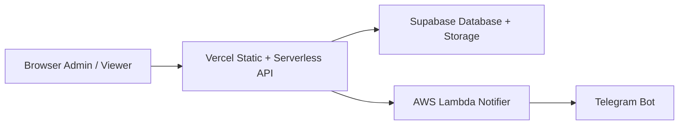

# Dashboard Maulagi

Dashboard internal untuk input bukti transfer, rekap transfer cabang, monitoring NONCOD/DFOD, dan operasi admin. Aplikasi memakai halaman HTML statis di root proyek, API serverless di folder `api/`, serta penyimpanan data dan file di Supabase. Notifikasi operasional berjalan dengan arsitektur hybrid Vercel -> AWS Lambda -> Telegram.

## Ringkasan

- Login admin berbasis password yang disimpan di tabel `settings`.
- Input transfer dengan upload bukti ke bucket `bukti-transfer`.
- Rekap transfer dan monitoring aktivitas cabang.
- Dashboard NONCOD dan DFOD dengan sinkronisasi data MauKirim.
- OCR bukti transfer untuk bantu baca nominal dan channel bank.
- Panel admin untuk kelola cabang, transfer, password, dan log error.
- Notifier operasional Telegram aktif lewat AWS Lambda tanpa memindahkan backend utama dari Vercel.

## Arsitektur Hybrid



Alur utamanya:

- Frontend dan API utama tetap jalan di Vercel.
- Data transaksi, master cabang, log, dan file bukti tetap disimpan di Supabase.
- AWS Lambda dipakai khusus untuk relay notifikasi operasional ke Telegram.
- Pola ini sengaja dipilih agar deploy tetap sederhana, biaya tetap hemat, tetapi stack terlihat lebih kuat untuk automation berikutnya.

## Stack

- Vercel untuk hosting statis dan fungsi serverless.
- Supabase untuk database dan penyimpanan objek.
- AWS Lambda untuk notifier operasional dan integrasi Telegram.
- HTML, CSS, dan JavaScript tanpa framework untuk frontend.
- Node.js untuk runtime API dan utilitas lokal.

## Struktur Proyek

```text
.
|-- api/           # Fungsi serverless Vercel dan helper backend
|-- lib/           # Modul browser/shared logic
|-- scripts/       # Utilitas lokal, template AWS Lambda, dan arsip lama
|-- supabase/      # Konfigurasi Supabase CLI dan migration database yang ditrack
|-- tests/         # Test Node bawaan
|-- *.html         # Halaman aplikasi
|-- sql-*.sql      # SQL tambahan untuk indeks dan keamanan
|-- vercel.json    # Konfigurasi deployment Vercel
```

Tambahan penting di dalam folder `scripts/`:

- Folder [scripts/aws/telegram-notifier](scripts/aws/telegram-notifier) berisi template AWS Lambda notifier Telegram.
- Folder [scripts/aws/noncod-sync-trigger](scripts/aws/noncod-sync-trigger) berisi template AWS Lambda trigger untuk pipeline sync NONCOD background.
- Folder [scripts/aws/ocr-worker](scripts/aws/ocr-worker) berisi template dan artifact builder untuk worker OCR terpisah.
- Dokumen aturan bisnis operasional dirangkum di [ATURAN-BISNIS-APLIKASI.md](ATURAN-BISNIS-APLIKASI.md).

## Halaman Utama

- `/index.html` untuk halaman awal dan akses masuk.
- `/dashboard.html` untuk halaman kerja utama.
- `/input.html` untuk input transfer dan OCR bukti.
- `/rekap.html` untuk rekap transfer per cabang.
- `/noncod.html` untuk monitoring NONCOD dan DFOD.
- `/admin.html` untuk operasi admin.

## Endpoint API

- `/api/auth` untuk login, setel password awal, dan ganti password.
- `/api/dashboard` untuk ringkasan transfer dashboard.
- `/api/input` untuk simpan transfer baru dan upload bukti.
- `/api/cabang` untuk list dan CRUD data cabang.
- `/api/transfer` untuk list, edit, hapus, dan split transfer.
- `/api/noncod` untuk ringkasan NONCOD/DFOD dan sinkronisasi data MauKirim.
- `/api/noncod-sync` untuk worker background sync NONCOD terautentikasi. Route ini di-rewrite ke handler [api/noncod.js](api/noncod.js) agar tetap muat di limit Vercel Hobby.
- Route internal penting yang dipakai frontend:
- `GET /api/dashboard?update=1` untuk cek ringkasan update transfer lewat [api/dashboard.js](api/dashboard.js).
- `GET /api/dashboard?watch=1` untuk membaca marker global perubahan workspace agar refresh panel bisa silent dan selektif lewat [api/dashboard.js](api/dashboard.js).
- `POST /api/input?dupe=1` untuk cek duplikasi dan konteks NONCOD lewat [api/input.js](api/input.js).
- `POST` dan `GET /api/input?ocr=1` untuk enqueue dan polling job OCR, serta `POST /api/input?ocr=1&worker=1` sebagai worker internal fallback, semuanya lewat [api/input.js](api/input.js).
- `GET /api/auth?ops=logs` untuk log operasional lewat [api/auth.js](api/auth.js).
- `GET /api/dashboard?visit=1` untuk visitor counter lewat [api/dashboard.js](api/dashboard.js).
- `GET /api/dashboard?maukirim=1&cabang=...` untuk daftar order MauKirim lewat [api/dashboard.js](api/dashboard.js).
- `/api/proxy-image` tetap untuk kebutuhan operasional.

## Persiapan Lokal

### Prasyarat

- Node.js 18 atau lebih baru.
- Node.js 20 atau lebih baru bila menjalankan Supabase CLI lewat `npx supabase`.
- Akun dan proyek Supabase.
- Proyek Vercel untuk menjalankan API secara lokal maupun produksi.

### Menjalankan Lokal

1. Install dependensi:

```bash
npm install
```

2. Salin `.env.example` menjadi `.env`.
3. Isi environment variable yang dibutuhkan di `.env`.
4. Jalankan aplikasi dengan perintah berikut:

```bash
npx vercel dev
```

5. Buka URL lokal yang ditampilkan oleh Vercel.

## Variabel Lingkungan

Template tersedia di [.env.example](.env.example).

```env
SUPABASE_URL=https://your-project.supabase.co
SUPABASE_ANON_KEY=your-anon-key-here
SUPABASE_SERVICE_ROLE_KEY=your-service-role-key-here
ALLOWED_ORIGIN=https://your-domain.vercel.app
MAUKIRIM_WA=628xxxxxxxxxx
MAUKIRIM_PASS=your-maukirim-password
GROQ_API_KEY=your-groq-api-key
OCR_SYNC_SECRET=your-vercel-ocr-worker-secret
OCR_PIPELINE_TRIGGER_URL=https://your-ocr-worker-url.lambda-url.ap-southeast-1.on.aws/
OCR_PIPELINE_TRIGGER_SECRET=your-ocr-trigger-secret
OCR_PIPELINE_TRIGGER_TIMEOUT_MS=15000
UPSTASH_REDIS_REST_URL=https://your-upstash-instance.upstash.io
UPSTASH_REDIS_REST_TOKEN=your-upstash-token
RATE_LIMIT_ALLOW_MEMORY_FALLBACK=0
NONCOD_SYNC_SECRET=your-vercel-sync-endpoint-secret
NONCOD_PIPELINE_TRIGGER_URL=https://your-lambda-or-worker-url
NONCOD_PIPELINE_TRIGGER_SECRET=your-trigger-secret
```

Kebutuhan utama:

- `SUPABASE_URL` dan `SUPABASE_SERVICE_ROLE_KEY` wajib untuk semua API server.
- `SUPABASE_ANON_KEY` opsional, dan tidak dipakai backend repo ini.
- `SUPABASE_SERVICE_ROLE_KEY` juga dipakai script maintenance lokal yang menulis/menghapus data.
- `MAUKIRIM_WA` dan `MAUKIRIM_PASS` dipakai untuk sinkronisasi NONCOD/DFOD.
- `GROQ_API_KEY` dipakai worker OCR. Jika production OCR diarahkan ke AWS Lambda, isi env ini di Lambda OCR worker. Jika masih memakai self-trigger fallback ke Vercel, isi juga di Vercel.
- `OCR_SYNC_SECRET` mengamankan worker internal `/api/input?ocr=1&worker=1`. Jika belum diisi, backend akan fallback ke `NONCOD_SYNC_SECRET` bila tersedia.
- `OCR_PIPELINE_TRIGGER_URL` dan `OCR_PIPELINE_TRIGGER_SECRET` mengarahkan enqueue OCR dari Vercel ke worker Lambda/background endpoint.
- `UPSTASH_REDIS_REST_URL` dan `UPSTASH_REDIS_REST_TOKEN` dipakai rate limiter lintas instance, dan dianggap jalur utama untuk production multi-instance.
- Simpan value Redis production tanpa quote pembungkus dan tanpa whitespace ekstra. Backend sekarang menormalkan nilai env yang terkutip atau ber-spasi, tetapi format raw yang bersih tetap yang direkomendasikan.
- `RATE_LIMIT_ALLOW_MEMORY_FALLBACK` hanya untuk override emergency sementara. Biarkan kosong atau `0` di production normal; jika diisi `1`, backend akan tetap jalan dengan limiter in-memory sambil mencatat warning runtime.
- `NONCOD_SYNC_SECRET` mengamankan endpoint worker internal `/api/noncod-sync`.
- Jika app berjalan di Vercel, `NONCOD_SYNC_SECRET` juga cukup untuk mode self-trigger langsung ke deployment aktif lewat `VERCEL_URL`.
- `NONCOD_PIPELINE_TRIGGER_URL` dan `NONCOD_PIPELINE_TRIGGER_SECRET` hanya perlu diisi bila trigger background harus diarahkan ke Lambda atau endpoint lain di luar self-trigger langsung.

## Higiene Repo GitHub

File yang aman disimpan di GitHub:

- Source code aplikasi di folder `api/`, `lib/`, `scripts/`, dan `tests/`.
- File konfigurasi dan migration Supabase di folder `supabase/`, selama tidak berisi secret aktif.
- File HTML, CSS, SQL, dan konfigurasi deploy seperti `vercel.json`, [sql-security.sql](sql-security.sql), dan [sql-admin-write-marker.sql](sql-admin-write-marker.sql).
- [.env.example](.env.example) karena hanya berisi placeholder, bukan kredensial aktif.

File yang tidak boleh masuk GitHub:

- Semua file env lokal yang berisi secret aktif seperti `.env`, `.env.local`, dan `.env.production.notifier`.
- Artifact lokal Supabase seperti `supabase/.branches/` dan `supabase/.temp/`.
- Folder atau file generated lokal seperti `.vercel/`, `tmp/`, `testsprite_tests/`, dan `TESTSPRITE-PRD.md`.
- Dump kredensial, keypair, proxy URL bertanam user:password, dan file one-off hasil export operasional.

Guardrail repo saat ini:

- `.gitignore` sudah menahan `.env`, `.env*.local`, `.env*.notifier`, `.vercel`, `testsprite_tests/`, `TESTSPRITE-PRD.md`, dan beberapa artifact lokal lain.
- `.vercelignore` juga menahan file test, tmp, dan artifact generated agar tidak ikut terdeploy.
- `supabase/.gitignore` menahan artifact CLI lokal seperti `.branches`, `.temp`, dan override env lokal Supabase.

Aturan praktis sebelum push:

1. Pastikan `git status --short` tidak menampilkan file env lokal, file credential, atau artifact generated.
2. Kalau secret pernah terlanjur committed, jangan hanya hapus dari working tree; rotate secret tersebut di provider terkait.
3. Anggap semua token, private key, cookie session, dan URL yang memuat kredensial sebagai data tidak aman untuk repo.

## Masukan dan Pelaporan Aman

Repo ini menerima masukan teknis, koreksi dokumentasi, laporan bug, dan kritik arsitektur selama disampaikan secara spesifik dan bisa ditindaklanjuti.

Pedoman praktis saat membuka issue atau PR:

- Sertakan gejala, dampak, dan langkah reproduksi minimum yang relevan.
- Kritik teknis terhadap keputusan desain, hardening production, tradeoff performa, atau kontrol keamanan sangat diterima jika dijelaskan dengan risiko konkret atau alternatif yang bisa diuji.
- Hindari menempelkan secret aktif seperti `SUPABASE_SERVICE_ROLE_KEY`, password, cookie sesi, bearer token, atau connection string database.
- Hindari mengunggah data operasional mentah seperti bukti transfer, payload transaksi lengkap, nomor telepon, atau data pelanggan yang tidak perlu.
- Jika perlu menyertakan log, redaksi identifier sensitif dan sisakan hanya konteks teknis yang dibutuhkan.
- Untuk isu keamanan yang belum diperbaiki, jangan buka detail exploit penuh di issue publik; cukup laporkan gejala dan dampaknya dengan data yang sudah disanitasi.

Tujuan section ini bukan membatasi kritik, tetapi menjaga agar diskusi teknis tetap berguna tanpa memperlebar risiko kebocoran data atau kredensial.

## Model Keamanan dan Batas Trust

Model keamanan aplikasi ini sengaja dibuat **backend-only untuk akses data utama**.

- Browser tidak mengakses tabel aplikasi Supabase secara langsung.
- Tabel `settings`, `cabang`, `transfers`, `noncod`, `visitors`, dan `error_logs` ditujukan untuk diakses lewat backend serverless, bukan lewat `anon key` dari frontend.
- `SUPABASE_SERVICE_ROLE_KEY` hanya dipakai di handler backend dan script maintenance tepercaya.
- RLS di tabel aplikasi diaktifkan untuk menutup akses role `anon` dan `authenticated`, lalu akses langsung ke tabel tersebut direvoke lewat [sql-security.sql](sql-security.sql).
- `SUPABASE_ANON_KEY` bersifat opsional dan tidak dipakai untuk akses data aplikasi utama di repo ini.

Batas trust yang perlu dipahami:

- Karena backend memakai service role, blast radius akan besar jika satu handler privileged berhasil dibypass atau dieksploitasi.
- Repo ini mengurangi risiko itu dengan meminimalkan surface area endpoint, membatasi route admin dengan session/token, dan menjaga agar semua akses data tetap lewat backend.
- Ini cocok untuk aplikasi internal/server-gated, tetapi **belum** ditujukan sebagai arsitektur multi-tenant dengan isolasi privilege yang sangat granular.

## Model Auth dan Limitasi Saat Ini

Auth saat ini memakai pemisahan role sederhana, bukan RBAC penuh.

- Role `admin` dipakai untuk upload, edit, pengaturan, log operasional, dan route sensitif lainnya.
- Role `dashboard` dipakai untuk akses viewer/workspace yang lebih terbatas.
- Session disimpan sebagai token acak yang di-hash, lalu diverifikasi backend lewat helper [api/_auth.js](api/_auth.js) dan [api/auth.js](api/auth.js).
- Password disimpan ter-hash di tabel `settings`, bukan plaintext.

Limitasi yang masih ada:

- Belum ada identity per-user yang kaya; akses masih berbasis role bersama, bukan akun individu per operator.
- Belum ada RBAC granular per aksi atau per resource.
- Belum ada audit trail lengkap per aktor untuk semua operasi bisnis; yang sudah ada lebih kuat di session boundary, error log, dan notifikasi operasional.

Untuk penggunaan internal solo dev atau tim kecil, model ini masih masuk akal. Untuk lingkungan yang lebih besar, section ini memang sengaja menjelaskan bahwa batasannya belum setara IAM/RBAC enterprise.

## Sumber Daya Supabase

Proyek ini mengandalkan resource berikut:

- Tabel settings
- Tabel cabang
- Tabel transfers
- Tabel noncod
- Tabel visitors
- Tabel error_logs
- Bucket storage bukti-transfer

Tambahan SQL di repo:

- [sql-indexes.sql](sql-indexes.sql) untuk indeks tambahan.
- [sql-admin-write-marker.sql](sql-admin-write-marker.sql) untuk RPC atomic `touch_admin_write_marker` yang dipakai watcher refresh workspace. File ini tetap disimpan sebagai mirror SQL manual/fallback di SQL Editor.
- [sql-security.sql](sql-security.sql) untuk enable RLS + revoke akses langsung pada tabel settings, cabang, transfers, noncod, visitors, dan error_logs.

Tambahan workflow database yang sekarang sudah ditrack:

- Folder [supabase/migrations](supabase/migrations) menyimpan migration yang didorong lewat Supabase CLI.
- Migration marker RPC sekarang sudah tersedia di folder itu, sehingga deploy database tidak lagi bergantung penuh pada copy-paste manual di SQL Editor.

## Skrip

- `npm run lint` untuk pemeriksaan sintaks file JavaScript.
- `npm run test` untuk menjalankan seluruh test.
- `npm run check` untuk menjalankan lint dan test sekaligus.
- `npm run local:cleanup` untuk cleanup manual data transfer, NONCOD, visitor lama, dan state OCR sementara.
- `npm run local:cleanup:dry` untuk simulasi cleanup tanpa hapus data.
- `npm run local:seed-cabang` untuk isi ulang master data cabang.

Utilitas maintenance yang masih aktif disimpan di folder [scripts/local](scripts/local).
Skrip migrasi dan integrasi lama yang sifatnya one-off diarsipkan di folder [scripts/legacy](scripts/legacy).

## Fallback Dependency dan Degradation Mode

Arsitektur ini memang bergantung pada beberapa layanan eksternal, tetapi beberapa jalur kritis sudah punya fallback agar kegagalan satu komponen tidak selalu mematikan alur utama.

- **Upstash/Redis limiter**: local dan test boleh memakai limiter in-memory. Production menganggap Redis REST sebagai jalur utama; bila Redis hilang atau gagal, request akan fail-closed lewat [api/_ratelimit.js](api/_ratelimit.js) kecuali override emergency `RATE_LIMIT_ALLOW_MEMORY_FALLBACK=1` sengaja diaktifkan.
- **OCR worker**: jika trigger worker OCR eksternal gagal, backend masih bisa fallback ke worker internal Vercel `waitUntil(...)` bila tersedia, lewat [api/input.js](api/input.js).
- **Telegram notifier**: notifikasi bersifat fire-and-forget dan tidak memblok request utama; kegagalan Lambda notifier tidak menghentikan alur bisnis utama.
- **NONCOD background sync**: pipeline bisa diarahkan ke Lambda terpisah, endpoint Vercel langsung, atau self-trigger via `VERCEL_URL` bila mode sederhana yang dipakai.
- **MauKirim sync**: jika refresh background gagal, endpoint baca tetap bisa melayani snapshot/published data terakhir sambil melaporkan status pipeline.

Artinya, sistem ini tidak bebas risiko third-party downtime, tetapi beberapa dependency penting sudah dirancang untuk degrade secara lebih aman daripada langsung hard-fail seluruh aplikasi.

## Cakupan Test dan Gap yang Diketahui

Test yang ada saat ini berfokus pada kombinasi unit, regression, dan API-level behavior untuk helper/helper backend yang paling sensitif.

Yang sudah tercakup:

- matcher NONCOD, hold cabang, pending allocation, carryover override, dan status override
- OCR parsing, OCR job pipeline, dan notifier behavior
- rate limiter, session cookie, proof signature, serta utilitas transfer
- beberapa jalur API seperti duplicate check, NONCOD sync, dan notify test

Yang **belum** diklaim selesai:

- belum ada end-to-end browser test penuh untuk alur user dari upload bukti sampai sukses submit
- belum ada integration test multipart upload lengkap yang mencakup upload storage + insert transfer + proof registry + pipeline trigger dalam satu skenario utuh
- perubahan besar di [api/input.js](api/input.js), auth/session boundary, atau integrasi storage masih tetap perlu smoke test manual setelah deploy

Section ini sengaja ditulis eksplisit agar pembaca GitHub tidak salah mengira bahwa seluruh flow utama sudah punya coverage e2e penuh.

## Smoke Test Manual Kritis

Checklist ini dipakai setelah deploy yang menyentuh [api/input.js](api/input.js), boundary auth/session, integrasi storage, pipeline OCR, atau marker refresh dashboard. Gunakan data dummy yang sudah disanitasi; jangan pakai bukti transfer asli, data pelanggan, nomor telepon, cookie sesi, atau secret aktif di screenshot/log.

1. Login sebagai admin dan buka [input.html](input.html). Pastikan halaman tidak mentok di error auth, spinner tak berujung, atau error frontend langsung setelah load.
2. Upload satu gambar bukti dummy berukuran kecil. Jika OCR aktif, pastikan job bergerak dari enqueue ke polling hasil `GET /api/input?ocr=1&job_id=...` tanpa macet. Jika OCR sedang dimatikan, isi field manual dan lanjutkan sampai siap submit.
3. Submit transfer ke cabang dan periode uji khusus. Harapkan hanya satu sukses submit, tanpa duplicate error palsu, timeout panjang, atau retry berulang dari browser.
4. Verifikasi hasil bisnis minimum. Data transfer baru harus muncul di workspace yang relevan seperti [dashboard.html](dashboard.html) atau [rekap.html](rekap.html), dan watcher `GET /api/dashboard?watch=1` harus menunjukkan marker berubah setelah write berhasil.
5. Verifikasi artefak backend minimum. File bukti dummy harus tersimpan di bucket `bukti-transfer`, log operasional tidak boleh memuat error baru yang relevan, dan bila OCR production diarahkan ke Lambda maka trigger utama harus menuju worker eksternal. Fallback internal `waitUntil(...)` diperlakukan hanya sebagai jalur preview/dev atau emergency rollback.
6. Cleanup seluruh artefak uji. Hapus transfer dummy dari panel admin atau endpoint admin yang sesuai, hapus override/status dengan prefix `SMOKE_TEST_...` bila ada, dan bersihkan file bukti atau state OCR sementara yang memang dibuat khusus untuk pengujian.
7. Catat hasil smoke test di catatan deploy singkat: environment, waktu uji, skenario yang lolos, kegagalan yang ditemukan, dan status cleanup.

## Supabase CLI dan Migrasi

Workflow database yang direkomendasikan untuk repo ini sekarang adalah lewat Supabase CLI.

Langkah minimum:

1. Install dependency repo dengan `npm install`.
2. Login CLI dengan `npx supabase login`.
3. Inisialisasi folder Supabase sekali per repo dengan `npx supabase init` bila folder `supabase/` belum ada.
4. Link ke project remote dengan `npx supabase link --project-ref <project-ref>`.
5. Dorong migration yang sudah ditrack dengan `npx supabase db push`.

Catatan penting:

- Migration marker RPC sudah disimpan di [supabase/migrations](supabase/migrations), sehingga CLI adalah jalur deploy database yang paling rapi dan repeatable.
- [sql-admin-write-marker.sql](sql-admin-write-marker.sql) tetap berguna sebagai mirror manual bila SQL Editor perlu dipakai untuk inspeksi atau recovery cepat.
- [sql-security.sql](sql-security.sql) masih berupa script manual terpisah; bila ingin seluruh perubahan database sepenuhnya tertata lewat migration, pindahkan script ini ke folder migration juga.
- Jangan commit file lokal yang berisi secret, profile override, atau artifact sementara dari CLI.

## Deploy

1. Hubungkan repository ke project Vercel.
2. Isi semua environment variable di Vercel Project Settings.
3. Jalankan migration database dengan `npx supabase db push` setelah repo dilink ke project Supabase yang benar.
4. Jika migration CLI tidak dipakai, jalankan [sql-admin-write-marker.sql](sql-admin-write-marker.sql) di Supabase SQL Editor sebagai fallback manual untuk memasang RPC `touch_admin_write_marker`.
5. Jalankan [sql-security.sql](sql-security.sql) di Supabase SQL Editor agar semua tabel aplikasi memakai RLS.
6. Pastikan backend memakai `SUPABASE_SERVICE_ROLE_KEY`, bukan fallback ke anon key.
7. Deploy branch main.

## Background Sync NONCOD

Pipeline background NONCOD sekarang mendukung pola berikut:

- Input transfer menandai pipeline NONCOD sebagai `dirty` lalu memicu worker secara fire-and-forget.
- Worker internal route `/api/noncod-sync` dijalankan oleh handler [api/noncod.js](api/noncod.js) dan memperbarui state pipeline di tabel `settings`.
- GET [api/noncod](api/noncod.js) tidak lagi menjadi pemicu stale refresh utama jika trigger background aktif; endpoint ini membaca data published terakhir dan mengembalikan status pipeline di `syncInfo.pipeline`.

Konfigurasi yang paling fleksibel:

1. `NONCOD_PIPELINE_TRIGGER_URL` boleh diarahkan ke AWS Lambda Function URL.
2. Lambda tersebut lalu meneruskan request ke route Vercel `/api/noncod-sync`.
3. Jika ingin lebih sederhana, `NONCOD_PIPELINE_TRIGGER_URL` juga boleh langsung diarahkan ke endpoint Vercel tadi.
4. Untuk deploy Vercel biasa tanpa Lambda, cukup isi `NONCOD_SYNC_SECRET`; backend akan memakai self-trigger ke deployment aktif lewat `VERCEL_URL`.

State pipeline disimpan di key `noncod_sync_pipeline_state` pada tabel `settings`, dengan status utama `idle`, `dirty`, `building`, `published`, atau `failed`.

## OCR Async Worker

Pipeline OCR sekarang memakai pola job async agar request upload bukti tidak menunggu Groq selesai di Vercel:

- Frontend mengirim gambar ke `POST /api/input?ocr=1` untuk membuat job OCR.
- Backend menyimpan file sementara ke bucket `bukti-transfer` dengan prefix `ocr-jobs/` lalu memicu worker OCR di background.
- Frontend memantau hasil lewat `GET /api/input?ocr=1&job_id=...`.
- Worker Lambda menulis hasil OCR kembali ke tabel `settings`, lalu frontend mengisi bank dan nominal seperti sebelumnya.

Komponen yang dipakai:

- Helper pipeline job: [api/_ocr-job-pipeline.js](api/_ocr-job-pipeline.js)
- Worker processor bersama: [api/_ocr-job-runner.js](api/_ocr-job-runner.js)
- Template Lambda: [scripts/aws/ocr-worker/index.js](scripts/aws/ocr-worker/index.js)
- Template Lambda untuk editor AWS default index.mjs: [scripts/aws/ocr-worker/index.mjs](scripts/aws/ocr-worker/index.mjs)

Langkah singkat:

1. Cara paling aman: jalankan satu command ini supaya folder worker, dependency runtime, dan zip upload-ready dibuat otomatis:

```bash
npm run package:ocr-worker
```

2. Jika ingin manual, jalankan build package worker:

```bash
npm run build:ocr-worker
```

3. Masuk ke folder artifact hasil build di `tmp/aws-ocr-worker-package`, lalu install dependency runtime:

```bash
cd tmp/aws-ocr-worker-package
npm install --omit=dev
```

4. Zip isi folder tersebut lalu upload ke Lambda Node.js baru.
5. Set handler Lambda ke `index.handler`.
6. Isi env Lambda berikut:
	- `SUPABASE_URL`
	- `SUPABASE_SERVICE_ROLE_KEY`
	- `GROQ_API_KEY`
	- `OCR_PIPELINE_TRIGGER_SECRET`
7. Aktifkan Function URL atau API Gateway untuk Lambda tersebut.
8. Isi env Vercel/app:
	- `OCR_PIPELINE_TRIGGER_URL`
	- `OCR_PIPELINE_TRIGGER_SECRET`
	- `OCR_PIPELINE_TRIGGER_TIMEOUT_MS=15000`
9. Redeploy Vercel.

Catatan operasional:

- Untuk traffic production paralel, arahkan `OCR_PIPELINE_TRIGGER_URL` ke Lambda agar OCR tidak berbagi concurrency dengan handler input utama di Vercel.
- `OCR_SYNC_SECRET` tetap berguna sebagai fallback internal untuk preview/dev atau emergency rollback.
- Jalur production yang direkomendasikan adalah trigger eksternal lewat `OCR_PIPELINE_TRIGGER_URL`; worker internal `waitUntil(...)` dipertahankan sebagai fallback saat preview/dev atau rollback darurat.
- Jika trigger Lambda OCR gagal tetapi request masih berjalan di Vercel, app akan fallback ke worker internal `waitUntil(...)` agar user tidak langsung mentok di error trigger.
- Artifact build Lambda disiapkan oleh [scripts/aws/build-ocr-worker-package.js](scripts/aws/build-ocr-worker-package.js).
- Upload artifact dari file zip hasil `npm run package:ocr-worker`, bukan hanya copy `index.js` ke editor AWS Lambda.
- Jika upload zip dilakukan tanpa `node_modules` runtime, Lambda Function URL akan balas `502 Internal Server Error` untuk semua job, termasuk job palsu.
- Jika Lambda Test menampilkan `Module worker OCR tidak ditemukan`, biasanya artifact aktif tidak membawa folder `api/` atau dependency runtime di `node_modules/`.
- Jika sebelumnya sudah upload artifact lama, upload ulang zip terbaru karena entrypoint worker standalone sudah diperbaiki.

## AWS Telegram Notifier

Repositori ini dapat meneruskan error backend terpilih ke AWS Lambda notifier Telegram tanpa memindahkan backend utama dari Vercel. Dengan pola ini, aplikasi utama tetap berjalan di Vercel, sementara Lambda dipakai khusus untuk relay notifikasi operasional.

Komponen yang dipakai:

- Helper backend: [api/_ops-notifier.js](api/_ops-notifier.js)
- Trigger default: [api/_logger.js](api/_logger.js)
- Template Lambda: [scripts/aws/telegram-notifier/index.js](scripts/aws/telegram-notifier/index.js)
- Template Lambda untuk editor AWS default index.mjs: [scripts/aws/telegram-notifier/index.mjs](scripts/aws/telegram-notifier/index.mjs)

Langkah singkat:

1. Buat Lambda Node.js baru di AWS.
2. Gunakan [scripts/aws/telegram-notifier/index.js](scripts/aws/telegram-notifier/index.js) sebagai entrypoint, atau [scripts/aws/telegram-notifier/index.mjs](scripts/aws/telegram-notifier/index.mjs) jika ingin menyesuaikan editor default ESM di AWS Lambda.
3. Isi env Lambda berikut:
	- `TELEGRAM_BOT_TOKEN`
	- `TELEGRAM_CHAT_ID`
	- `TELEGRAM_NOTIFY_SECRET`
	- Opsional: `TELEGRAM_MESSAGE_THREAD_ID`
4. Aktifkan Function URL atau API Gateway untuk Lambda tersebut.
5. Isi env Vercel/app:
	- `TELEGRAM_NOTIFY_URL`
	- `TELEGRAM_NOTIFY_SECRET`
	- `TELEGRAM_NOTIFY_SOURCES`
	- Opsional: `TELEGRAM_NOTIFY_SERVICE`
6. Isi `TELEGRAM_NOTIFY_SOURCES` dengan source tertentu seperti `noncod,auth`, atau gunakan `*` jika ingin semua error backend ikut terkirim.

Catatan:

- Notifier ini bersifat fire-and-forget dan tidak memblok request utama.
- Shared secret diverifikasi di Lambda lewat header `X-Ops-Secret`.
- Sumber notifikasi dikontrol oleh `TELEGRAM_NOTIFY_SOURCES`, misalnya `noncod,auth` atau `*` untuk seluruh backend.
- Notifikasi otomatis dibatasi untuk event error/critical; event non-error rutin tidak dikirim ke Telegram.
- Pendekatan ini sengaja memakai pola hybrid agar repo tetap ringan di Vercel, tetapi tetap punya jejak integrasi AWS yang nyata dan siap dikembangkan.

## AWS NONCOD Sync Trigger

Template Lambda ada di:

- [scripts/aws/noncod-sync-trigger/index.js](scripts/aws/noncod-sync-trigger/index.js)
- [scripts/aws/noncod-sync-trigger/index.mjs](scripts/aws/noncod-sync-trigger/index.mjs)

Env Lambda yang dipakai:

- `NONCOD_PIPELINE_TRIGGER_SECRET` untuk memverifikasi trigger dari backend/app.
- `NONCOD_SYNC_ENDPOINT_URL` untuk URL target Vercel, misalnya `/api/noncod-sync`.
- `NONCOD_SYNC_ENDPOINT_SECRET` untuk header `X-Sync-Secret` ke endpoint target.
- Opsional: `NONCOD_SYNC_PERIODES` untuk override daftar periode sinkron.
- Opsional: `NONCOD_SYNC_FORCE` untuk memaksa refresh saat Lambda dipanggil scheduler.

## Pengembangan

- Helper backend ada di `api/_*.js`.
- Logika frontend bersama ada di `lib/`.
- Test memakai `node --test` tanpa framework tambahan.
- Aturan bisnis operasional tambahan dirangkum di [ATURAN-BISNIS-APLIKASI.md](ATURAN-BISNIS-APLIKASI.md).
- File HTML utama tetap menjadi titik masuk tiap modul halaman.
