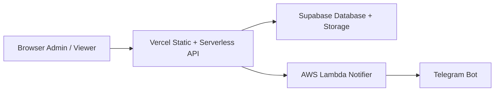

# Dashboard Maulagi

> Internal operations dashboard for transfer input, branch recap, NONCOD/DFOD monitoring, and OCR-assisted workflows.
>
> Dashboard operasional internal untuk input transfer, rekap cabang, monitoring NONCOD/DFOD, dan alur kerja berbantuan OCR.

---

## Overview / Gambaran Umum

**EN:** A serverless internal web application for transfer operations, branch monitoring, MauKirim-based NONCOD/DFOD reporting, and operational admin workflows.

**ID:** Aplikasi web internal berbasis serverless untuk operasional transfer, monitoring cabang, pelaporan NONCOD/DFOD berbasis MauKirim, dan workflow admin operasional.

**EN:** Runtime secrets are managed outside the repo, with Bitwarden Secrets Manager as the source of truth and automated sync targets for Vercel and AWS Lambda.

**ID:** Runtime secret dikelola di luar repo, dengan Bitwarden Secrets Manager sebagai source of truth dan target sinkronisasi otomatis ke Vercel serta AWS Lambda.

---

## What It Does / Fungsi Utama

**EN:**
- Transfer input with proof-of-payment upload
- OCR-assisted amount and bank extraction from payment proof
- Per-branch recap and workspace monitoring
- NONCOD/DFOD dashboard synchronized from MauKirim
- Admin tools for data management, logs, and operational settings
- Telegram-based operational notifications through AWS Lambda relay

**ID:**
- Input transfer dengan upload bukti pembayaran
- Bantuan OCR untuk ekstraksi nominal dan bank dari bukti transfer
- Rekap per cabang dan monitoring workspace
- Dashboard NONCOD/DFOD yang tersinkronisasi dari MauKirim
- Tool admin untuk manajemen data, log, dan pengaturan operasional
- Notifikasi operasional berbasis Telegram melalui relay AWS Lambda

---

## Technical Decisions / Keputusan Teknis

**EN:** The project is structured to keep the main app simple on Vercel while offloading background-heavy work to external workers.

**ID:** Proyek ini disusun agar aplikasi utama tetap sederhana di Vercel, sementara pekerjaan background yang berat dipindahkan ke worker eksternal.

### Operational rules / Aturan operasional

**EN:** Business behavior is intentionally strict. MauKirim remains the source of truth for raw NONCOD data, reconciliation stays FIFO by business date, and transfer matching must preserve the current operational rules.

**ID:** Perilaku bisnis sengaja dibuat ketat. MauKirim tetap menjadi source of truth untuk data NONCOD mentah, rekonsiliasi tetap FIFO berdasarkan tanggal bisnis, dan matching transfer harus mempertahankan aturan operasional yang berlaku sekarang.

See `ATURAN-BISNIS-APLIKASI.md` for the authoritative business rules.

Lihat `ATURAN-BISNIS-APLIKASI.md` untuk aturan bisnis yang menjadi acuan utama.

### Hybrid architecture / Arsitektur hybrid



**EN:** Vercel serves the frontend and primary API. Supabase stores operational data and files. The hybrid pattern started with the Telegram Lambda relay and is now also used by background-heavy flows such as OCR processing and NONCOD sync.

**ID:** Vercel melayani frontend dan API utama. Supabase menyimpan data operasional dan file. Pola hybrid ini awalnya dipakai untuk relay Telegram di Lambda dan sekarang juga dipakai pada alur background yang lebih berat seperti OCR dan sync NONCOD.

### Backend-only data access / Akses data hanya dari backend

**EN:** Supabase tables are accessed through backend handlers using the service role key. The browser does not talk directly to the main operational tables.

**ID:** Tabel Supabase diakses melalui handler backend dengan service role key. Browser tidak berkomunikasi langsung dengan tabel operasional utama.

### Async pipelines / Pipeline asinkron

**EN:** OCR and NONCOD refresh flows use background triggers so user-facing requests can return quickly while longer work continues outside the main request path.

**ID:** Alur OCR dan refresh NONCOD memakai trigger background agar request user bisa selesai cepat sementara pekerjaan yang lebih panjang berjalan di luar request utama.

### Access model / Model akses

**EN:** Access is split into `admin`, `dashboard`, and `viewer` sessions. Admin and dashboard access use backend-managed role sessions, while viewer access is verified against branch WhatsApp and MauKirim credentials before a hashed session is issued.

**ID:** Akses dibagi ke sesi `admin`, `dashboard`, dan `viewer`. Akses admin dan dashboard memakai sesi role yang dikelola backend, sedangkan akses viewer diverifikasi lewat WhatsApp cabang dan kredensial MauKirim sebelum sesi yang di-hash diterbitkan.

---

## Stack

| Layer | Technology |
|---|---|
| Frontend | HTML, CSS, JavaScript |
| API | Node.js serverless on Vercel |
| Database | Supabase PostgreSQL |
| File storage | Supabase Storage |
| Background jobs | AWS Lambda (Node.js) |
| Rate limiting | Upstash Redis |
| OCR | Groq API |
| Notifications | Telegram Bot via Lambda relay |
| Data source | MauKirim |

---

## Project Structure / Struktur Proyek

```text
api/           Serverless API handlers and backend helpers
lib/           Shared browser logic
scripts/aws/   Lambda worker templates and packaging scripts
scripts/local/ Local maintenance utilities
supabase/      Supabase config and tracked migrations
tests/         Node.js test suite
*.html         Application pages
sql-*.sql      Manual SQL helpers for security and indexing
```

---

## Running Locally / Menjalankan Lokal

**Prerequisites / Prasyarat**
- Node.js 18+
- Vercel project
- Supabase project

**Steps / Langkah**

```bash
npm install
npx vercel dev
```

Duplicate `.env.example` into `.env`, then fill the required variables before running locally.

Duplikasi `.env.example` menjadi `.env`, lalu isi variabel yang dibutuhkan sebelum menjalankan app secara lokal.

---

## Key Environment Variables / Variabel Lingkungan Utama

See `.env.example` for the full template.

Lihat `.env.example` untuk template lengkap.

| Variable | Purpose |
|---|---|
| `SUPABASE_URL` + `SUPABASE_SERVICE_ROLE_KEY` | Main backend database access |
| `MAUKIRIM_WA` + `MAUKIRIM_PASS` | NONCOD/DFOD synchronization |
| `GROQ_API_KEY` | OCR processing |
| `OCR_PIPELINE_TRIGGER_URL` + `OCR_PIPELINE_TRIGGER_SECRET` | OCR background worker trigger |
| `NONCOD_PIPELINE_TRIGGER_URL` + `NONCOD_PIPELINE_TRIGGER_SECRET` | NONCOD background worker trigger |
| `TELEGRAM_NOTIFY_URL` + `TELEGRAM_NOTIFY_SECRET` | Operational notification relay |
| `UPSTASH_REDIS_REST_URL` + `UPSTASH_REDIS_REST_TOKEN` | Multi-instance rate limiting |

---

## Runtime Secret Sync / Sinkronisasi Runtime Secret

**EN:** Runtime secret management is intentionally split from source code. Bitwarden Secrets Manager is the canonical source, while Vercel and AWS Lambda are treated as runtime targets only.

**ID:** Pengelolaan runtime secret sengaja dipisahkan dari source code. Bitwarden Secrets Manager adalah sumber kanonik, sedangkan Vercel dan AWS Lambda hanya menjadi target runtime.

### GitHub workflow / Workflow GitHub

The repository includes `.github/workflows/runtime-secret-sync.yml` with two modes:

- `workflow_dispatch` for manual verify or sync runs
- scheduled nightly sync at `17 2 * * *`

**Required GitHub repository secrets / Secret GitHub yang wajib ada:**

- `BW_ACCESS_TOKEN`
- `AWS_ACCESS_KEY_ID`
- `AWS_SECRET_ACCESS_KEY`
- `VERCEL_TOKEN`

**EN:** The workflow prepares Vercel project metadata, installs the `bws` CLI, reads the configured Bitwarden project directly, then verifies or syncs secrets to Vercel and Lambda without printing secret values.

**ID:** Workflow menyiapkan metadata project Vercel, memasang CLI `bws`, membaca langsung project Bitwarden yang dikonfigurasi, lalu memverifikasi atau menyinkronkannya ke Vercel dan Lambda tanpa mencetak nilai secret.

**EN:** This avoids brittle UUID-only secret loading in GitHub Actions, so secret rotation inside Bitwarden does not immediately break the workflow as long as the required key names remain available in the target project.

**ID:** Ini menghindari pemuatan secret berbasis UUID statis di GitHub Actions, sehingga rotasi secret di Bitwarden tidak langsung mematahkan workflow selama nama key wajib tetap tersedia di project target.

### Local maintenance scripts / Skrip lokal

Use these commands for local verification or manual sync:

```bash
npm run local:verify-bws-runtime -- --source env --target all
npm run local:sync-bws-runtime -- --project-id <bitwarden-project-id> --target all
npm run local:sync-vercel-env -- --file .env.local --environment production
```

**EN:** The sync tooling validates secret shape before deployment, including semantic validation for `SUPABASE_ANON_KEY` and `SUPABASE_SERVICE_ROLE_KEY` so an anon key cannot silently replace backend credentials.

**ID:** Tooling sync ini memvalidasi bentuk secret sebelum deploy, termasuk validasi semantik untuk `SUPABASE_ANON_KEY` dan `SUPABASE_SERVICE_ROLE_KEY` agar anon key tidak diam-diam menggantikan kredensial backend.

### Optional runtime keys / Key runtime opsional

These keys are treated as optional and do not block the main release when absent:

- `OCR_PIPELINE_TRIGGER_URL`
- `OCR_PIPELINE_TRIGGER_SECRET`
- `TELEGRAM_MESSAGE_THREAD_ID`

---

## Available Scripts / Skrip Tersedia

| Command | Purpose |
|---|---|
| `npm run lint` | Syntax check |
| `npm run test` | Run test suite |
| `npm run check` | Run lint and tests |
| `npm run local:verify-bws-runtime` | Verify runtime secrets from env or Bitwarden without applying changes |
| `npm run local:sync-bws-runtime` | Sync runtime secrets from Bitwarden or env to Vercel and Lambda |
| `npm run local:sync-vercel-env` | Sync selected `.env` keys to Vercel environments safely |
| `npm run build:ocr-worker` | Build OCR Lambda package contents |
| `npm run package:ocr-worker` | Build zip-ready OCR Lambda package |
| `npm run build:noncod-worker` | Build NONCOD Lambda package contents |
| `npm run package:noncod-worker` | Build zip-ready NONCOD Lambda package |
| `npm run local:cleanup` | Cleanup local operational test data |
| `npm run local:seed-cabang` | Seed branch master data |

---

## Notes / Catatan

- Main pages live at `index.html`, `dashboard.html`, `input.html`, `rekap.html`, `noncod.html`, and `admin.html`.
- Database migrations tracked in `supabase/migrations` are complemented by manual SQL helpers such as `sql-security.sql`, `sql-indexes.sql`, and `sql-admin-write-marker.sql`.
- AWS Lambda templates for notifier, OCR worker, and NONCOD sync worker are available under `scripts/aws/`.
- Runtime secret sync is designed to avoid reading committed env files in CI and to avoid printing sensitive values in logs.
- Changes to Vercel production environment variables require a redeploy before the live runtime uses the new values.
